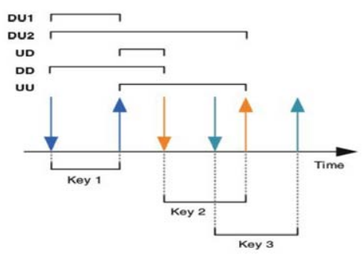
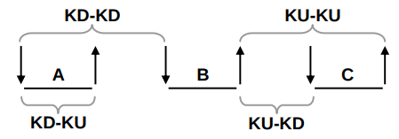

## HeLOI
<b>He</b>nrique <b>LO</b>gin <b>I</b>nteligente

- Reconhecimento de tempo de digitação do usuário para autenticação em sistema utilizando regressao linear
- Recognition of user typing time for system authentication using linear regression
- Признание времени ввода пользователя для аутентификации системы с использованием линейной регрессии
- 使用线性回归识别系统认证的用户输入时间
- Reconnaissance du temps de saisie de l'utilisateur pour l'authentification du système à l'aide de la régression linéaire

Escolhas de features para input do treinamento:

